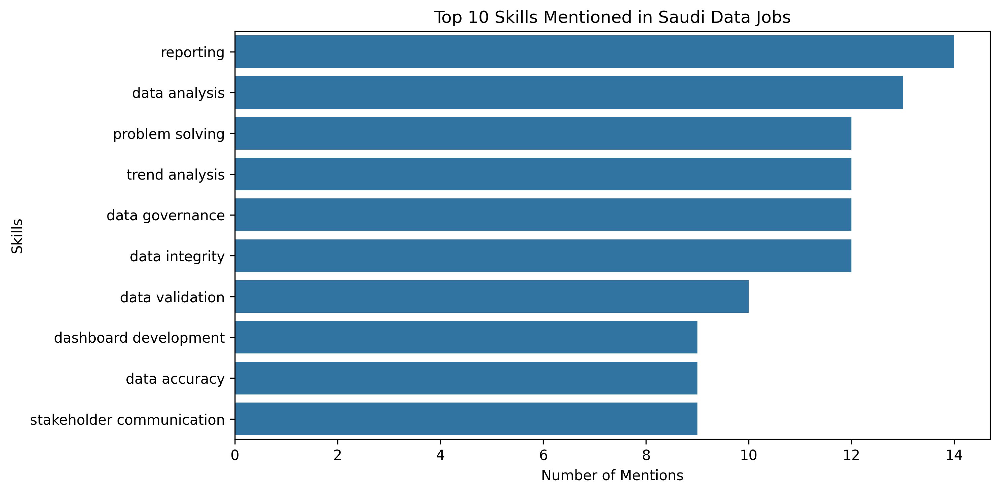
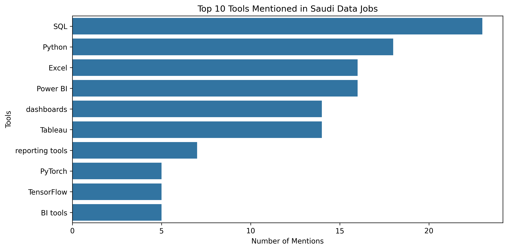

# Saudi Data Internship Readiness Map

## 1. Project Overview

The Saudi Data Internship Readiness Map project analyzes Saudi data-related internship and job opportunities to identify the most requested skills, tools, and requirements in the local data job market.

The main goal of this project is to understand the capabilities and knowledge areas demanded by employers and transform these insights into a practical readiness roadmap for Computer Science students and beginners preparing for data-related internships and entry-level roles in Saudi Arabia.

---

## Problem Statement

The data field contains many different career paths, job titles, and technical requirements, which can make it challenging for students to understand which skills, tools, and knowledge areas they should prioritize when preparing for internships and early-career opportunities.

This project addresses this challenge by analyzing real Saudi data-related job postings and extracting the most relevant market requirements to provide a clearer learning direction based on actual employer needs.

---

## Project Objective

The objective of this project is to analyze Saudi data-related opportunities and identify:

- The most requested technical skills.
- The most commonly used tools.
- Different data career roles and their requirements.
- Experience expectations for internship and entry-level opportunities.
- The learning areas needed to become better prepared for data careers.

The extracted insights are then transformed into a structured readiness roadmap for students interested in Data Science, Analytics, and related fields.

---

## Project Scope

The project focuses on analyzing Saudi data-related internship and job opportunities through:

- Required technical skills analysis.
- Tools frequency analysis.
- Role category analysis.
- Experience level analysis.
- City distribution analysis.

The project covers multiple data career pathways, including:

- Data Analysis.
- Business Intelligence.
- Data Science.
- AI-related roles.
- Data Governance.
- Analytics and reporting roles.

---

## Project Workflow

The project follows a complete data analysis workflow, including:

1. Data collection and organization.
2. Data cleaning and preparation.
3. Exploratory data analysis.
4. Skills and tools analysis.
5. Role and experience analysis.
6. Data visualization.
7. Power BI dataset preparation.
8. Documentation and career roadmap development.

---

## Project Outcomes

The main outcomes of this project include:

- A cleaned and structured dataset of Saudi data-related opportunities.
- Analysis of required skills, tools, roles, cities, and experience levels.
- Visualizations that summarize important market trends.
- A Power BI-ready dataset for dashboard development.
- A career readiness roadmap connecting market requirements with learning stages.
- Technical documentation of the complete data analysis workflow.

## 2. Dataset Overview

The dataset used in this project contains Saudi data-related internship and job postings collected to analyze the current requirements of the local data job market.

The final dataset contains **45 job postings** collected from different data career categories, including internship opportunities and early-career roles.

Each row in the dataset represents one job opportunity, while each column describes a specific attribute related to that opportunity.

---

## Dataset Content

The dataset includes information about:

- Job titles.
- Companies.
- Locations.
- Role categories.
- Experience requirements.
- Required technical skills.
- Required tools.
- Source information.

---

## Dataset Columns

The main columns included in the dataset are:

| Column | Description |
|---|---|
| job_id | Unique identifier for each job posting |
| job_title | Title of the job opportunity |
| company | Company providing the opportunity |
| city | Location mentioned in the job posting |
| role_type | Original role classification |
| experience_level | Required experience information |
| skills | Skills mentioned in the job description |
| tools | Tools and technologies mentioned |
| source | Source where the opportunity was collected |
| job_link | Original job posting reference |
| date_collected | Date when the data was collected |
| notes | Additional observations related to the posting |

---

## Analysis-Ready Columns

During the data preparation stage, additional columns were created to improve analysis consistency and support comparisons between different job categories.

The created columns include:

### city_cleaned

A standardized version of the city information used for location analysis.

### experience_category

A simplified classification of experience requirements into broader groups:

- Internship.
- Entry Level.
- Mid-Level.
- Senior.
- Not Specified.

### role_category

A categorized version of job roles to support career path analysis, including:

- Data Analysis.
- Business Intelligence.
- Data Science.
- AI-related roles.
- Governance.
- Other categories.

---

## Dataset Purpose

The purpose of preparing this dataset is to create a structured foundation for analyzing Saudi data career requirements and identifying the skills, tools, and learning areas needed for internship and early-career readiness.

## 3. Data Collection and Preparation

The project started by collecting Saudi data-related internship and job postings to create a structured dataset that represents current requirements in the local data job market.

The collected opportunities were organized into a tabular format where each job posting represents one record containing information about the role, company, location, required skills, and required tools.

---

## Data Collection Process

The dataset collection focused on Saudi data-related opportunities, including:

- Internship opportunities.
- Entry-level roles.
- Data analysis positions.
- Business Intelligence roles.
- Data Science roles.
- AI and analytics-related opportunities.

The collected information was stored in a structured dataset containing job-related attributes that support further analysis.

---

## Data Preparation Workflow

After collecting the initial dataset, a preparation workflow was applied before performing analysis.

The workflow included:

1. Reviewing the dataset structure and available columns.
2. Checking data quality and consistency.
3. Preparing the dataset for cleaning and transformation.
4. Creating analysis-ready fields to support comparisons between different job categories.

---

## Dataset Transformation

During the preparation stage, additional fields were introduced to make the data more suitable for analysis.

These transformations included:

- Standardizing city information using `city_cleaned`.
- Grouping experience requirements into broader categories using `experience_category`.
- Classifying job titles into career paths using `role_category`.

These prepared fields enabled further analysis of:

- Geographic distribution.
- Experience requirements.
- Different data career pathways.

---

## Preparation for Analysis

The prepared dataset was used as the foundation for the following project stages:

- Exploratory Data Analysis.
- Skills analysis.
- Tools analysis.
- Role analysis.
- Experience analysis.
- Visualization development.
- Power BI dashboard preparation.

This preparation stage ensured that the dataset was structured, consistent, and ready for meaningful analysis.

## 4. Data Cleaning Process

Before performing analysis, the collected dataset went through a data cleaning and transformation process to improve data quality and make it suitable for analysis.

The cleaning stage focused on ensuring that the dataset was consistent, complete, and structured for further exploration.

---

## Data Quality Checks

Several checks were performed to evaluate the quality of the collected data, including:

### Dataset Structure Review

The dataset structure was reviewed to understand:

- Number of records.
- Available columns.
- Data types.
- Information contained in each field.

The final dataset contains:

- 45 job posting records.
- 15 columns after the preparation stage.

---

## Duplicate Records Check

Duplicate records were checked to ensure that the dataset did not contain repeated job postings.

The validation included checking:

- Complete duplicate rows.
- Duplicate job links.
- Duplicate combinations of job titles and companies.

No duplicate records were identified in the final dataset.

---

## Missing Values Check

Missing values were reviewed across all dataset columns to ensure that important information required for analysis was available.

The final dataset was validated before moving to the analysis stage.

---

## Data Transformation

Additional transformations were applied to improve analysis quality.

### City Standardization

The original city information contained different location formats.

A new column was created:

`city_cleaned`

This column standardized location values and improved city-based analysis.

---

### Experience Classification

The original experience information contained different descriptions and formats.

A new classification column was created:

`experience_category`

The experience requirements were grouped into broader categories:

- Internship.
- Entry Level.
- Mid-Level.
- Senior.
- Not Specified.

---

### Role Classification

Job titles were transformed into broader career categories using:

`role_category`

This allowed comparison between different data career paths, including:

- Data Analysis.
- Business Intelligence.
- Data Science.
- AI-related roles.
- Governance.
- Other roles.

---

## Final Cleaned Dataset

After completing the cleaning and transformation process, the dataset became ready for:

- Exploratory Data Analysis.
- Skills analysis.
- Tools analysis.
- Role analysis.
- Experience analysis.
- Visualization development.
- Power BI dashboard preparation.

The cleaned dataset provided a reliable foundation for extracting insights from Saudi data-related job opportunities.

## 5. Exploratory Data Analysis

After completing the data cleaning and preparation process, exploratory data analysis (EDA) was performed to understand the main characteristics and patterns within the Saudi data-related job dataset.

The purpose of this stage was to explore the structure of the dataset, identify important distributions, and prepare the data for deeper analysis.

---

## EDA Objectives

The exploratory analysis focused on understanding:

- Distribution of job opportunities across cities.
- Different data-related role categories.
- Experience requirements.
- Commonly requested skills and tools.

---

## Dataset Exploration

The dataset was examined to understand the overall structure and identify the main characteristics of Saudi data-related opportunities.

The analysis included reviewing:

- Dataset size.
- Available attributes.
- Job categories.
- Experience levels.
- Technical requirements.

---

## Job Market Distribution Analysis

The project analyzed how data-related opportunities are distributed across different dimensions.

The analysis included:

### City Distribution

Job postings were analyzed based on location to understand where data-related opportunities are concentrated in Saudi Arabia.

### Role Categories

Job titles were grouped into broader career categories to identify different pathways available in the data field.

### Experience Levels

Experience requirements were analyzed to understand the availability of:

- Internship opportunities.
- Entry-level roles.
- Mid-level positions.
- Senior roles.

---

## Exploration Results

The exploratory analysis provided an initial understanding of the Saudi data job market and created the foundation for detailed analysis in the following sections:

- Skills Analysis.
- Tools Analysis.
- Role Analysis.
- Experience Analysis.
- Career Readiness Roadmap.

This stage helped transform the raw cleaned dataset into meaningful insights about data career requirements in Saudi Arabia.

## 6. Skills Analysis

The project analyzed the most frequently mentioned skills in Saudi data-related internship and job postings to identify the capabilities most requested by employers.

The purpose of this analysis was to understand which technical and analytical skills students should prioritize when preparing for data-related careers.

---

## Skills Extraction Process

The skills information was extracted from the dataset and analyzed by counting the frequency of mentioned skills across job postings.

This analysis helped identify the skills that appear most frequently in Saudi data-related opportunities.

---

## Key Skills Identified

The analysis highlighted several important skills required in data-related roles, including:

- Data Analysis.
- Reporting.
- Problem Solving.
- Data Governance.
- Data Integrity.
- Data Validation.
- Dashboard Development.
- Data Visualization.
- Business Intelligence.
- Machine Learning.

---

## Technical and Analytical Skill Requirements

The findings show that employers look for a combination of technical abilities and analytical/business skills.

Technical skills help candidates work with data, tools, and analysis processes, while analytical skills support understanding data, communicating insights, and solving business problems.

---

## Importance for Students

Based on the analysis, students preparing for data internships should focus on developing:

- Strong data analysis foundations.
- Ability to clean and validate data.
- Visualization and reporting skills.
- Understanding of business requirements.
- Practical experience through projects.

---

## Visualization

The skill analysis results were visualized to highlight the most frequently requested skills in Saudi data-related opportunities.

---

## Key Finding

The analysis indicates that successful preparation for data-related careers requires more than learning programming tools. Students need a combination of technical data skills, analytical thinking, and the ability to communicate insights effectively.

## 7. Tools Analysis

The project analyzed the most frequently requested tools in Saudi data-related internship and job postings to identify the technologies commonly required by employers.

The purpose of this analysis was to understand which tools students should prioritize when preparing for data-related internships and early-career opportunities.

---

## Tools Extraction Process

The tools information was extracted from job postings and analyzed by measuring how frequently each tool appeared across the dataset.

This analysis provided an overview of the technologies most commonly mentioned in Saudi data-related roles.

---

## Key Tools Identified

The analysis showed that the most frequently requested tools include:

- SQL.
- Python.
- Power BI.
- Excel.
- Tableau.

Additional tools identified in the dataset include:

- Machine Learning tools.
- Cloud-related technologies.
- Data processing and analytics tools.

---

## Tool Importance in Data Careers

The findings indicate that employers commonly look for a combination of:

- Database skills through SQL.
- Programming and data analysis skills through Python.
- Reporting and visualization capabilities through Power BI and Excel.

These tools represent important foundations for students preparing for data analysis, Business Intelligence, and Data Science career paths.

---

## Tool Requirements Across Roles

The project also analyzed the relationship between tools and different role categories.

The analysis showed that tool requirements vary depending on the career path:

- Data Analyst roles emphasize SQL, Excel, Python, and visualization tools.
- BI roles commonly require reporting and dashboard tools.
- Data Science roles require programming and machine learning-related tools.

---

## Visualization

The tool analysis results were visualized to highlight the most frequently requested technologies in Saudi data-related opportunities.

---

## Key Finding

SQL appeared as one of the most important tools across the dataset, followed by Python and visualization tools.

This suggests that students aiming for data-related careers should build a strong foundation in SQL, Python, and data visualization before advancing to more specialized technologies.

## 8. City Analysis

## 9. Career Readiness Roadmap

## 10. Power BI Dashboard

## 11. Conclusion
