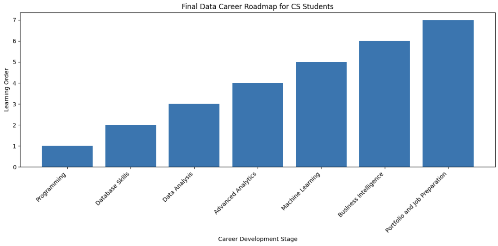
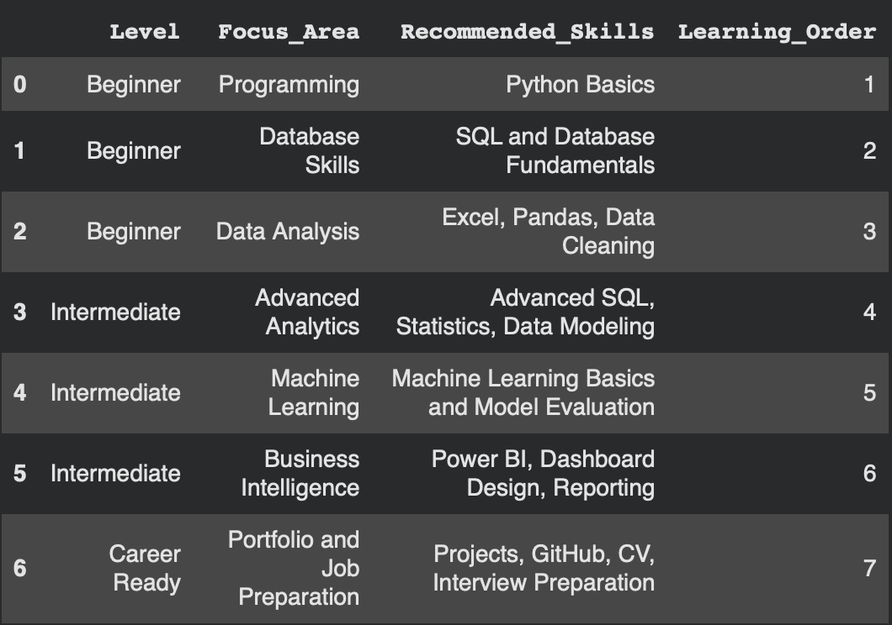

# Data Career Readiness Roadmap

## Overview

This roadmap was created based on the analysis of Saudi data-related job postings.

The goal is to organize the most requested skills and tools into a practical learning path for Computer Science students preparing for data internships and early-career roles.

---

# Learning Roadmap

## Beginner Level

Focus:
Building the foundation required for data careers.

Skills:
- Python Basics
- SQL and Database Fundamentals
- Excel
- Data Cleaning
- Pandas
- Basic Data Analysis

## Intermediate Level

Focus:
Developing stronger analytical and technical capabilities.

Skills:
- Advanced SQL
- Statistics
- Data Modeling
- Machine Learning Fundamentals
- Model Evaluation
- Power BI
- Dashboard Development
- Reporting

## Career Ready Level

Focus:
Preparing for internships and job opportunities.

Skills:
- Real Data Projects
- GitHub Portfolio
- CV Preparation
- Interview Preparation

# Career Paths

## Data Analyst

Focus:
- SQL
- Excel
- Python
- Data Visualization

## BI Analyst

Focus:
- Power BI
- Reporting
- Dashboards

## Data Scientist

Focus:
- Python
- Statistics
- Machine Learning

## Analytics Engineer

Focus:
- SQL
- Data Modeling
- Data Pipelines

# Methodology

This roadmap was created using:

- Technical skills analysis.
- Tools analysis.
- Role category analysis.
- Experience level analysis.

The objective is to connect Saudi data job market requirements with a structured learning path.

---

# Visual Roadmap

## Final Data Career Roadmap

## Roadmap Details Table

