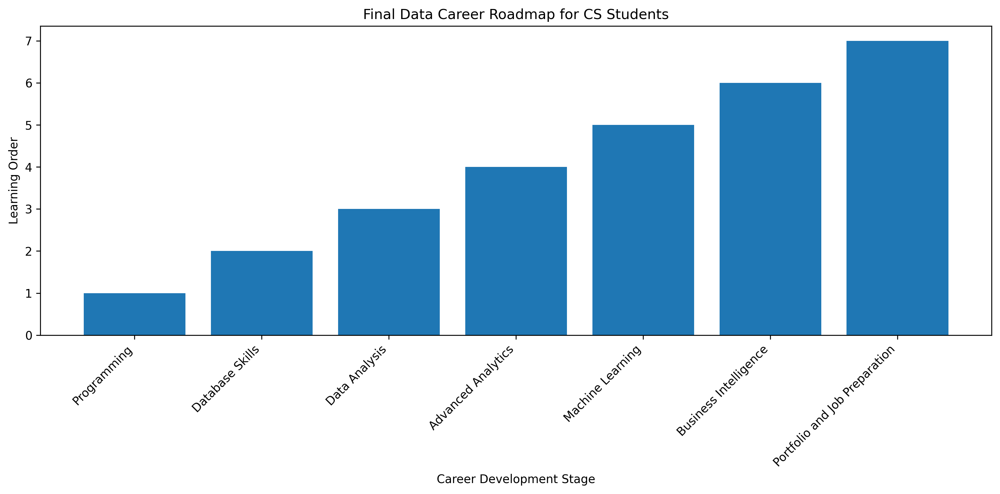
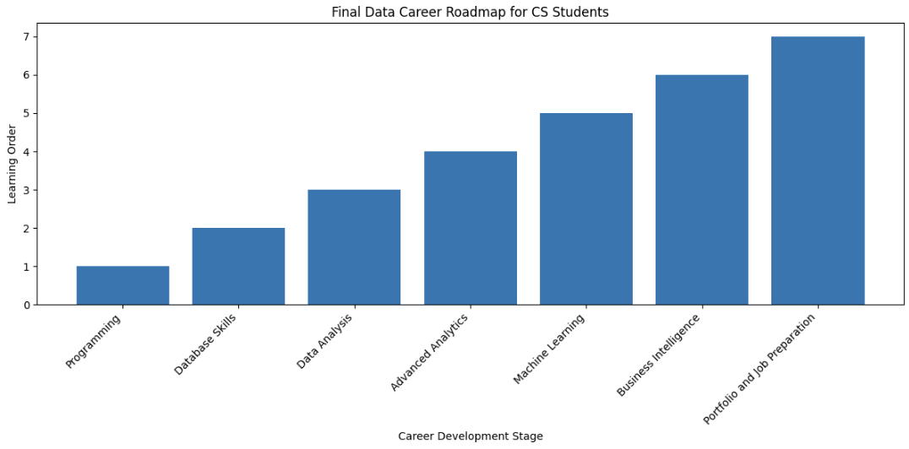
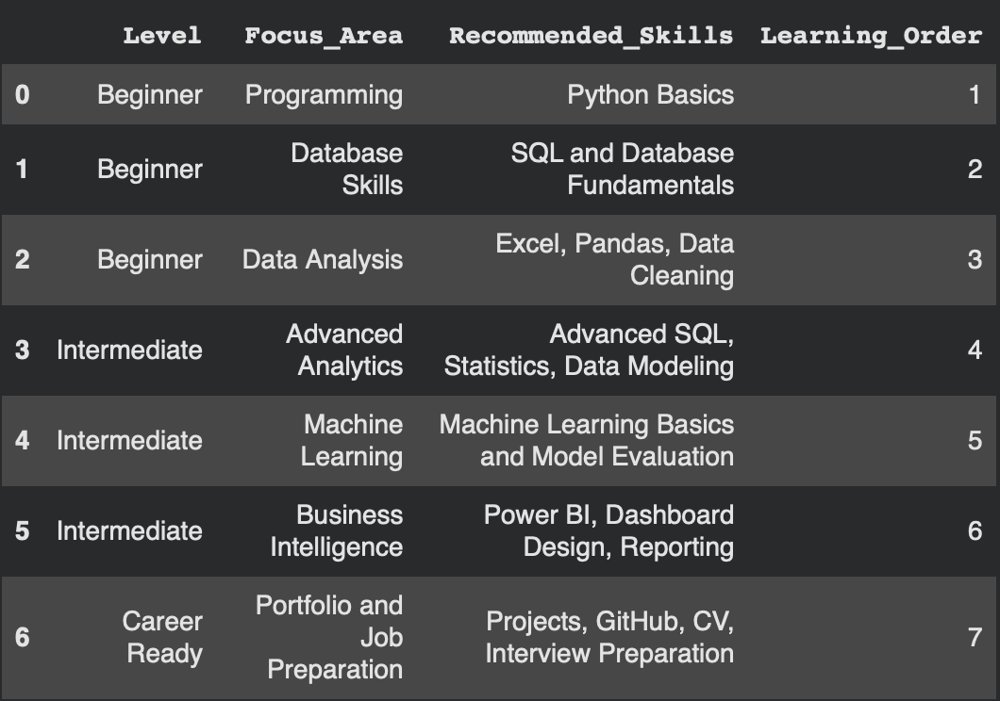

# Data Career Readiness Roadmap

## Overview

This roadmap was developed based on the analysis of Saudi data-related job postings.

The goal is to organize the most requested skills, tools, and knowledge areas into a practical learning path for Computer Science students preparing for data internships and early-career opportunities.

---

# Learning Roadmap

## Beginner Level

### Focus

Building the foundation required to start a career in data.

### Skills

- Python Basics.
- SQL and Database Fundamentals.
- Excel.
- Data Cleaning.
- Pandas.
- Basic Data Analysis.
- Data Visualization Basics.

---

## Intermediate Level

### Focus

Developing stronger analytical and technical capabilities required for professional data roles.

### Skills

- Advanced SQL.
- Statistics.
- Data Modeling.
- Machine Learning Fundamentals.
- Model Evaluation.
- Power BI.
- Dashboard Development.
- Reporting.

---

## Career Ready Level

### Focus

Preparing students for internships and early-career data opportunities.

### Skills

- Real Data Projects.
- GitHub Portfolio.
- CV Preparation.
- Interview Preparation.
- Technical Documentation.

---

# Career Paths

The project connects different skill combinations with possible data career paths.

## Data Analyst

### Focus

- SQL.
- Excel.
- Python.
- Data Visualization.
- Reporting.

---

## BI Analyst

### Focus

- Power BI.
- Reporting.
- Dashboard Development.
- Business Intelligence.

---

## Data Scientist

### Focus

- Python.
- Statistics.
- Machine Learning.
- Model Evaluation.

---

## Analytics Engineer

### Focus

- SQL.
- Data Modeling.
- Data Pipelines.
- Data Platforms.

---

# Methodology

This roadmap was created based on:

- Technical skills analysis.
- Tools analysis.
- Role category analysis.
- Experience level analysis.
- Job focus analysis.

The objective is to connect Saudi data job market requirements with a structured learning path that helps students understand what skills and technologies they should prioritize.

---

# Roadmap Outputs

The roadmap analysis generated:

- Beginner Data Career Roadmap.
- Intermediate Data Career Roadmap.
- Final Data Career Roadmap.
- Career Path Mapping.

## Visual Roadmap

### Final Data Career Roadmap

### Final Data Career Roadmap Chart

### Final Data Career Roadmap Table

---

# Conclusion

This roadmap transforms Saudi data job market insights into a practical preparation framework.

It helps Computer Science students understand the progression from foundational skills to professional readiness for data-related careers.
